<div align="center">


# Registrace

**Bilingual (CZ / EN) event-registration platform for Diamond Way Buddhism (BDC) centres.**

Public visitors register themselves and fellow participants for meditation and community
events; the app prices the stay server-side and emails a bilingual confirmation. Centre
admins manage events, registrations and exports — all scoped by role and centre.

[](https://registrace.online)
&nbsp;


</div>

<p align="center">
  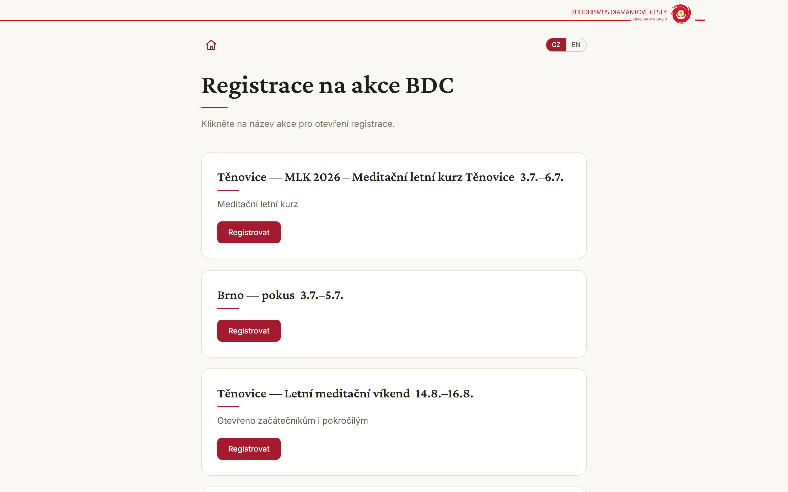
  &nbsp;
  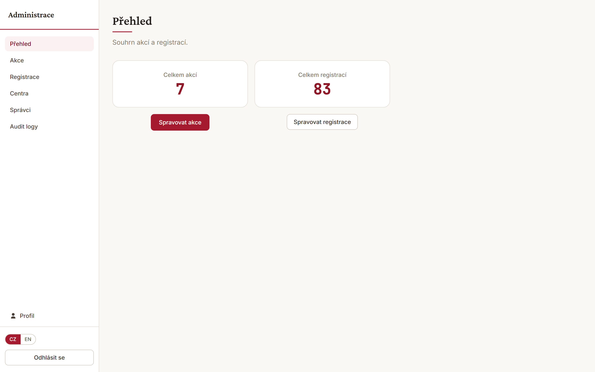
</p>

---

## Table of contents

- [What it is](#what-it-is)
- [Screenshots](#screenshots)
  - [Visitor side](#visitor-side)
  - [Admin side](#admin-side)
- [Feature highlights](#feature-highlights)
- [Tech stack](#tech-stack)
- [Architecture](#architecture)
  - [Non-negotiable rules](#non-negotiable-rules)
  - [Request & data flow](#request--data-flow)
  - [Pricing engine](#pricing-engine)
  - [Data model](#data-model)
  - [API map](#api-map)
- [Security & privacy](#security--privacy)
- [Internationalization](#internationalization)
- [Getting started](#getting-started)
- [Environment variables](#environment-variables)
- [npm scripts](#npm-scripts)
- [Project structure](#project-structure)
- [Testing](#testing)
- [Deployment](#deployment)
- [Documentation](#documentation)
- [Status & roadmap](#status--roadmap)
- [License & credits](#license--credits)

---

## What it is

**Registrace** is a production web application built for
[Buddhismus Diamantové cesty](https://www.bdc.cz) (BDC / Diamond Way Buddhism) — a network of
Czech meditation centres. It replaces ad-hoc spreadsheets and email threads with a single
bilingual flow:

1. A visitor opens a published event, fills in one form for the whole group (up to 10
   participants), picks arrival/departure, meals and diet per person, and submits.
2. The **server** recalculates every price from the event's own pricing rules (the browser
   figure is informational only), writes an idempotent registration, and sends a confirmation
   email carrying a human-readable registration number (e.g. `260020108`).
3. Centre admins review, filter, search, mark paid, resend confirmations, and export a
   per-event XLSX for the kitchen and accommodation teams — always scoped to the centres they
   manage.

It is **live in production at [registrace.online](https://registrace.online)** on Vercel +
Supabase, and has been through a full internal build (B1–B8), a production-hardening pass
(P1–P8) and a multi-agent security audit. This README is the
single source of orientation for anyone joining the project.

---

## Screenshots

> All screenshots use the demo dataset (`prisma/seed-demo.ts`) — fictional families on the
> RFC-2606 reserved `example.*` domains. The **admin email addresses and the audit-log IP
> column are blurred here on purpose** for privacy: they are shown normally to admins in the
> running app — only these public screenshots hide them.

### Visitor side

<table>
  <tr>
    <td width="50%"></td>
    <td width="50%">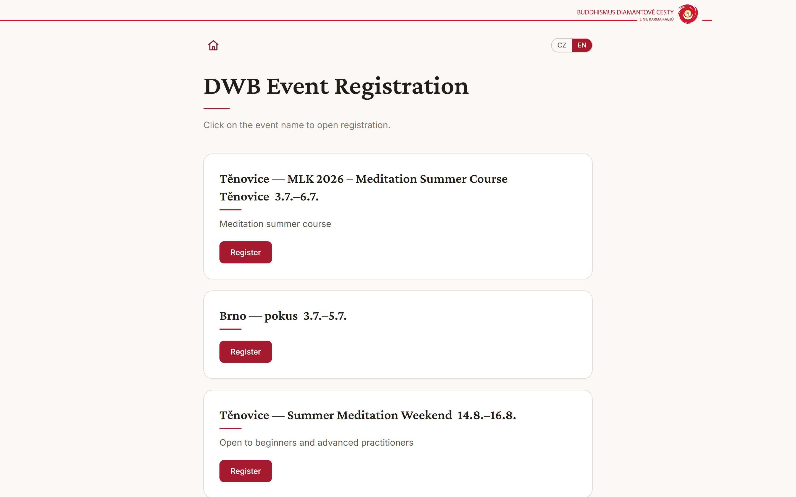</td>
  </tr>
  <tr>
    <td align="center"><em>Homepage — published events (CZ)</em></td>
    <td align="center"><em>Same page, one click to English</em></td>
  </tr>
  <tr>
    <td width="50%">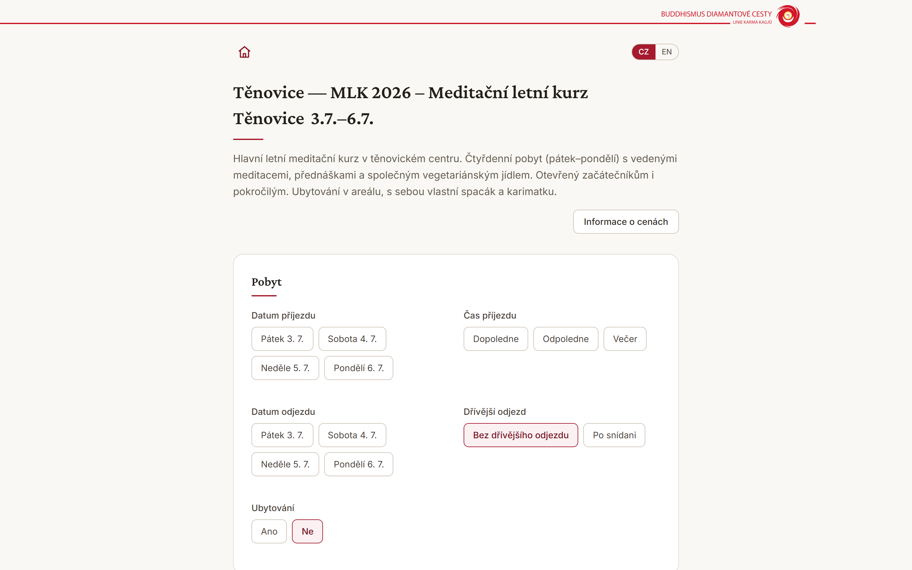</td>
    <td width="50%">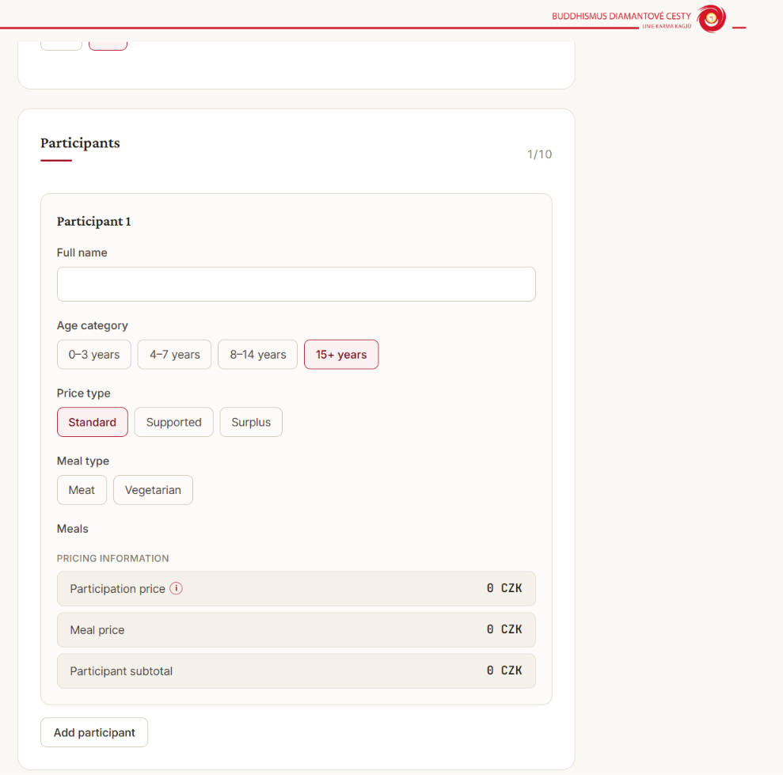</td>
  </tr>
  <tr>
    <td align="center"><em>Event detail + stay (arrival, departure, accommodation)</em></td>
    <td align="center"><em>Per-participant age, price tier, diet & live total</em></td>
  </tr>
</table>

<p align="center">
  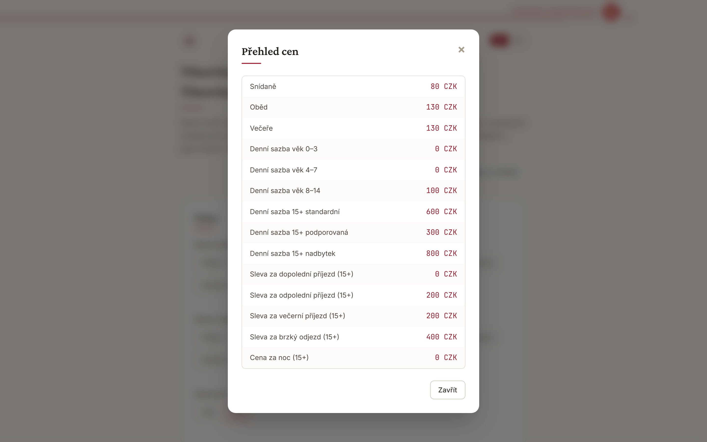<br/>
  <em>Transparent, data-driven price overview — meals, daily rates per age and tier, arrival/early-departure discounts.</em>
</p>

### Admin side

<table>
  <tr>
    <td width="50%">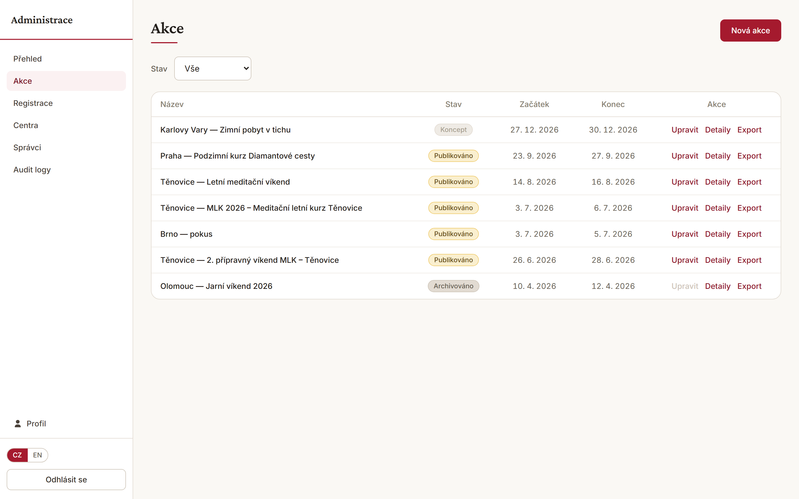</td>
    <td width="50%">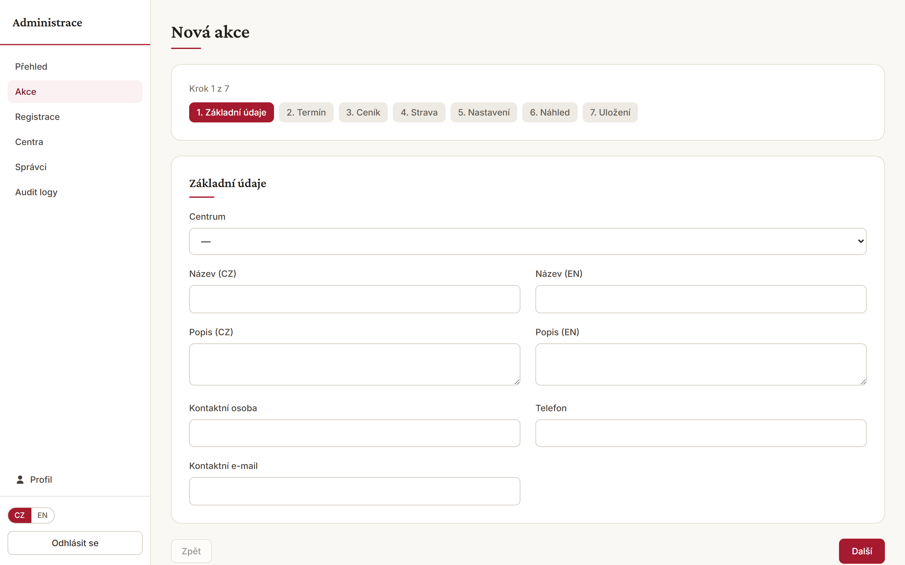</td>
  </tr>
  <tr>
    <td align="center"><em>Event management — draft / published / archived, per-event export</em></td>
    <td align="center"><em>7-step bilingual event wizard</em></td>
  </tr>
  <tr>
    <td width="50%">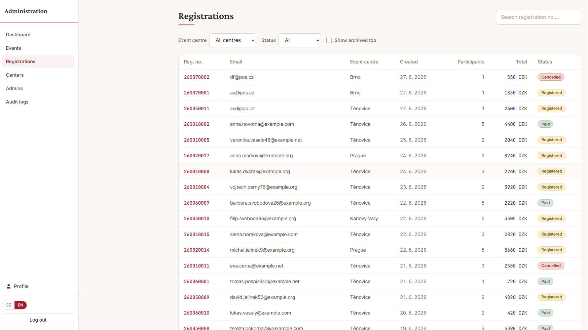</td>
    <td width="50%">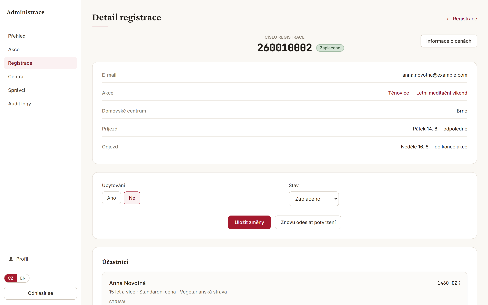</td>
  </tr>
  <tr>
    <td align="center"><em>Registrations — filter, search by number, status badges</em></td>
    <td align="center"><em>Registration detail — status, accommodation, participants</em></td>
  </tr>
  <tr>
    <td width="50%">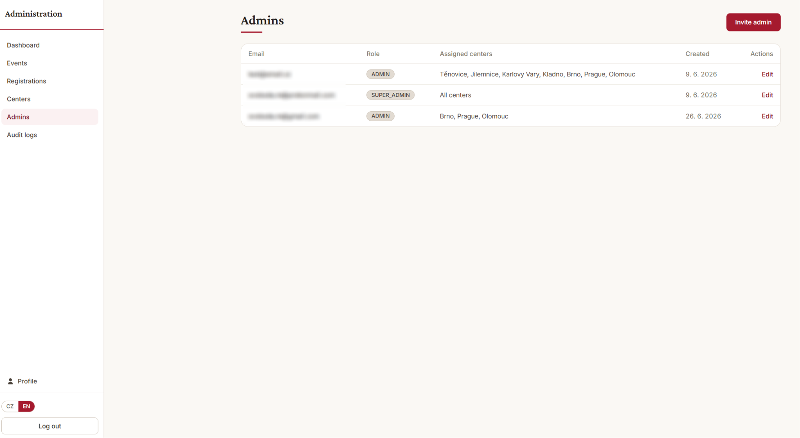</td>
    <td width="50%">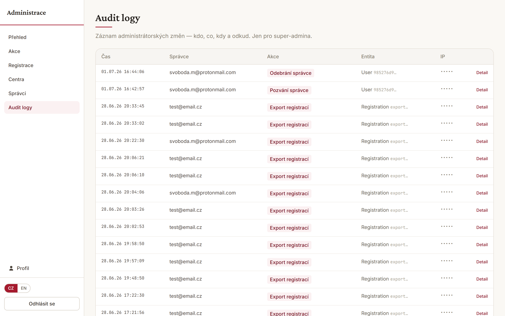</td>
  </tr>
  <tr>
    <td align="center"><em>Admins — SUPER_ADMIN vs centre-scoped ADMIN</em></td>
    <td align="center"><em>Audit log — who, what, when, where (super-admin only)</em></td>
  </tr>
</table>

<p align="center">
  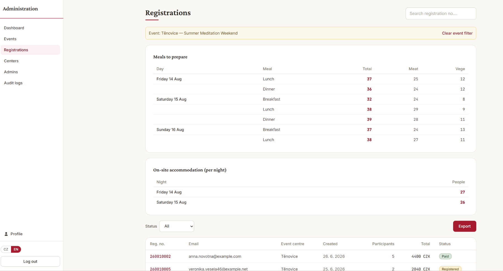<br/>
  <em>Per-event kitchen &amp; accommodation planning — meat/veg counts per meal and headcount per night, ready for the kitchen and accommodation teams.</em>
</p>

---

## Feature highlights

### For visitors

- **Bilingual throughout** — every page and email in Czech or English; the switch preserves
  the current place.
- **Group registration** — one submission for up to **10 participants**, each with their own
  age category, price tier (standard / supported / surplus) and diet (meat / vegetarian).
- **Per-day meal selection** with a per-event **meal-ordering deadline** (after the cut-off,
  meal choice is closed and enforced server-side).
- **Live, server-authoritative pricing** — the form shows a running total, but the backend
  always recomputes the authoritative price before saving.
- **Arrival time, early departure and accommodation** all feed into the price via the event's
  own discount and night-rate rules.
- **Human-readable registration number** (`YYEEENNNN`) and a polished, BDC-branded
  confirmation email.
- **Privacy-first** — in-app GDPR consent, server-validated honeypot, idempotent submit.

### For admins

- **Role-based access** — `SUPER_ADMIN` sees everything; `ADMIN` is scoped to their assigned
  centre(s); an **owner tier** guards super-admin management.
- **7-step event wizard** — bilingual titles/descriptions, dates, pricing rules per age &
  tier, meals per day, capacity, and the meal deadline. Empty drafts stay fully editable.
- **Event lifecycle** — draft → published → closed → archived, with a public visibility
  window derived on read.
- **Registration workflow** — filter by centre / status / archived, search by number, edit
  status (registered / paid / cancelled), resend confirmations, and read **kitchen** (meat /
  veg totals) and **accommodation** (per-night headcount) tables.
- **Per-event XLSX export** — one click per event, with a formula-injection-safe serializer.
- **Centre & admin management** — invite/edit/remove admins, assign centres, soft-delete and
  restore centres.
- **Audit log** — a forensic trail of admin actions (actor, action, entity, IP, time).

---

## Tech stack

| Layer | Choice | Notes |
|---|---|---|
| Framework | **Next.js 16** (App Router, Turbopack) · **React 19** | Server Components + route handlers; no `middleware.ts` — edge logic lives in `proxy.ts` |
| Language | **TypeScript** (strict, `noUncheckedIndexedAccess`) | — |
| ORM | **Prisma 7** + `@prisma/adapter-pg` (`pg`) | Driver-adapter pattern; client generated to `generated/prisma` (gitignored) |
| Database & Auth | **Supabase** (PostgreSQL + Auth) | RLS deny-all; all data access goes through Prisma |
| Validation | **Zod 4** | Client-safe schemas (no Prisma imports) |
| Forms | **React Hook Form** + `@hookform/resolvers` | — |
| i18n | **next-intl 4** | Locales `cs` (default) / `en` |
| Email | **Resend** | Bilingual, inline-CSS, non-blocking |
| Export | **exceljs** | XLSX (chosen over the vulnerable `xlsx` package) |
| Styling | **Tailwind CSS v4** | Design tokens via `@theme` in `globals.css`, no JS config |
| Tests | **Vitest** (+ v8 coverage) | 93 unit / integration tests |
| Hosting | **Vercel** + own domain (Wedos DNS) | Auto-deploy on push to `main` |

Exact versions live in [`package.json`](package.json). **No Docker.**

---

## Architecture

### Non-negotiable rules

These invariants are enforced across the codebase (full list in
[`CLAUDE.md`](CLAUDE.md)):

1. **Auth = Supabase Auth. Data = Prisma. Never mix.**
2. The **pricing engine** (`modules/pricing`) is **pure, server-only, no DB access**.
3. **Frontend prices are informational**; backend prices are authoritative and always
   recomputed server-side before any DB write.
4. UI text lives in next-intl JSON; **event content lives in bilingual DB columns**
   (`*_cs` / `*_en`).
5. **Email failure never rolls back** the registration transaction.
6. **Soft delete** (`deletedAt`) everywhere — no permanent deletion of audit-relevant data.
7. **Money = whole-CZK integers**; **datetimes = UTC in the DB, Europe/Prague in the UI**.
8. Registration submit is **idempotent** (client-supplied UUID v4 key), honeypot-guarded,
   and capped at 10 participants.
9. **SUPER_ADMIN sees all; ADMIN is scoped to their centre(s).**

### Request & data flow

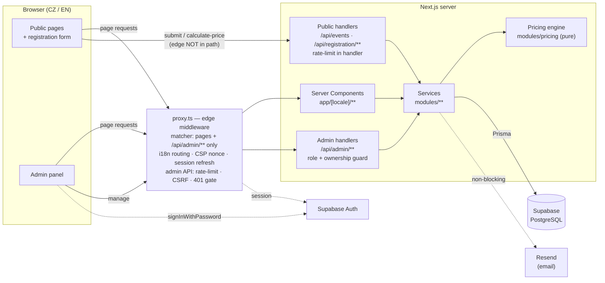

- **Edge** (`proxy.ts`) is deliberately **not** a global gate: its `config.matcher` covers
  pages and `/api/admin/**` **only**. On pages it does locale routing, the CSP nonce and
  Supabase session refresh; on the admin API it adds rate-limiting (120/min/IP), a CSRF
  same-origin check on mutations, and a 401 for anonymous callers. It checks session
  **presence** only.
- **The public API bypasses the edge entirely** — `/api/events`, `/api/registration/**` and
  `/api/auth/me` are excluded by the matcher and reach their handlers directly, so each one
  enforces its own rate limit (submit 10/h, price 60/min, public reads 60/min per IP).
- **Handlers/services** are the authoritative **role/ownership** gate (Prisma can't run at the
  edge). Business logic never lives in a route handler — it lives in `modules/*`, which Server
  Components call directly rather than fetching their own API.
- **Prices** are computed by the pure engine and re-verified before every write.

### Pricing engine

`modules/pricing/index.ts` is pure and defensive (a missing rule or degenerate stay yields
`0`, never throws — the price endpoint calls it mid-edit on incomplete input). Per participant:

```
participation = dailyRate × days
              − arrival discount      (by arrival time: morning / afternoon / evening)
              − early-departure discount
              + nightRate × (days − 1)   (only when accommodation is chosen)
              floored at 0

meals         = Σ price of each unique, open, known selected meal
subtotal      = participation + meals
```

Pricing is **data-driven**: every age is charged by its matching `PricingRule.dailyRate` — no
age is hard-coded to `0`. Young children carry a `0`-rate rule, but an event may charge, say,
ages 8–14 (the real BDC "MLK" course does, at 100 CZK/day). Discounts apply to 15+ only
because child rules carry `0` discounts — not via any age branch.

### Data model

11 Prisma models, 9 enums, 6 applied migrations. The source of truth is
[`prisma/schema.prisma`](prisma/schema.prisma).

<details>
<summary><strong>Models (click to expand)</strong></summary>

| Model | Purpose |
|---|---|
| **User** | `id @db.Uuid` (= Supabase Auth id), `email`, `role`. |
| **UserCenter** | Explicit `User ↔ Center` join (which centres an admin manages). |
| **Center** | 25 seeded rows — 23 BDC centres plus the `Jiné` / `Mimo ČR` (Other / outside CZ) catch-alls a visitor can pick as their home centre. Bilingual names, `sortOrder`, soft-active. |
| **Event** | Bilingual title/subtitle/description, contact fields, `status`, `centerId` (host centre), dates, `createdBy`, `mealRegistrationDeadline`, `numberPrefix` + `registrationSeq` (reg-number support). |
| **EventDate** | A day of the event; used as arrival/departure reference. |
| **PricingRule** | Per `event × ageCategory × pricingType`: `dailyRate`, `nightRate` and the four `*Discount` fields (subtracted). |
| **EventMeal** | A meal slot on a given day: `mealType`, `price`, `isClosed`. |
| **Registration** | The submission: home `centerId`, arrival/departure, `hasAccommodation`, `email`, `gdprConsent`, `totalPrice`, `status`, `idempotencyKey`, `registrationNumber`, `locale`, `ipAddress`. |
| **Participant** | One person: `ageCategory`, `pricingType`, `mealType` (diet), computed prices. |
| **ParticipantMeal** | `Participant ↔ EventMeal` join with the charged price. |
| **AuditLog** | Append-only trail: `userId`, `action`, `entityType`, `entityId`, `oldData`/`newData`, `ip`. |

**Enums:** `AgeCategory` · `PricingType` (standard / supported / surplus) · `ArrivalTime` ·
`EarlyDeparture` · `EventStatus` (draft / published / closed / archived) · `MealType`
(breakfast / lunch / dinner) · `MealCategory` (meat / vegetarian) · `RegistrationStatus`
(registered / cancelled / paid) · `UserRole` (super_admin / admin).

</details>

### API map

<details>
<summary><strong>Routes (click to expand)</strong></summary>

**Public** (not matched by `proxy.ts` — each handler rate-limits itself)
- `GET  /api/events` · `GET /api/events/[id]` — 60/min per IP
- `POST /api/registration/calculate-price` — 60/min per IP
- `POST /api/registration/submit` — 10/hour per IP

**Admin** (edge: session + rate-limit + CSRF; handler: role/ownership)
- Events — `GET`/`POST /api/admin/events`, `GET`/`PUT /api/admin/events/[id]`,
  `PATCH /api/admin/events/[id]/status`
- Registrations — `GET /api/admin/registrations`, `GET`/`PUT /api/admin/registrations/[id]`,
  `POST /api/admin/registrations/export`, `POST /api/admin/registrations/[id]/resend-confirmation`
- Centres — `GET`/`POST /api/admin/centers`, `PUT`/`DELETE`/`PATCH /api/admin/centers/[id]`
  (`DELETE` soft-deletes, `PATCH` restores)
- Admins — `GET`/`POST /api/admin/users`, `PUT`/`DELETE /api/admin/users/[id]`,
  `POST /api/admin/users/[id]/reset-password`
- Audit — `GET /api/admin/audit-log`

**Auth** — `GET /api/auth/me` (60/min per IP; login/logout go through the Supabase browser
client, not a route handler).

Validation errors return a canonical `400 { error, details }` (Zod issues) via the shared
`validationError()` helper.

</details>

---

## Security & privacy

- **Content-Security-Policy** with a **per-request nonce** + `strict-dynamic` (set in
  `proxy.ts`), dropping `unsafe-inline` from `script-src` in production.
- **Static security headers** in `next.config.ts`, applied to every response —
  `Strict-Transport-Security: max-age=31536000; includeSubDomains; preload`,
  `X-Frame-Options: DENY`, `X-Content-Type-Options: nosniff`,
  `Referrer-Policy: strict-origin-when-cross-origin`,
  `Permissions-Policy: camera=(), microphone=(), geolocation=()` and
  `Cross-Origin-Resource-Policy: same-origin`. (The `preload` directive is a one-way
  commitment and only takes effect once the domain is submitted at
  [hstspreload.org](https://hstspreload.org/).)
- **CSRF** — mutating admin requests must be same-origin, checked against
  `NEXT_PUBLIC_APP_URL`. **Fail-closed**: a missing Origin *and* Referer, or an unset
  `NEXT_PUBLIC_APP_URL`, is rejected; the any-localhost relaxation is gated to non-production.
- **Rate limiting** — best-effort in-memory limits: admin API 120/min/IP at the edge; submit
  10/hour, price calc 60/min and public reads 60/min enforced inside each public handler.
- **Audit log** — best-effort, non-blocking; never rolls back the business write.
- **No browser-direct data access** — the Supabase anon key is used for **Auth only**; the JS
  client never reads or writes tables. Every data access goes through Prisma on the server,
  which connects directly and bypasses RLS by design.
- **RLS** — enabled **deny-all** on all 12 public tables (the 11 models + `_prisma_migrations`):
  row security is on and **zero policies** are defined, so nothing is reachable through the
  anon key. This is a **backstop**, not the access control — the real authorization is the
  role/ownership gate in the handlers and services. It is configured in the Supabase project
  itself rather than in this repo's migrations; verify with
  `select tablename, rowsecurity from pg_tables where schemaname = 'public'` (expect all
  `true`) and `select * from pg_policies where schemaname = 'public'` (expect no rows).
  Supabase's Security Advisor reports this as informational "RLS Enabled No Policy", which is
  the intended state here.
- **Owner tier** — only an owner (`OWNER_USER_IDS`, immutable Supabase ids; verified-email
  `OWNER_EMAILS` fallback) may create/modify super-admins. Both lists empty → nobody can
  (fail-closed).
- **Admin password policy** — at least 12 characters with a lowercase letter, an uppercase
  letter, a digit and a symbol, shown as a live checklist while the password is typed, with a
  per-field show/hide toggle and a live match indicator on the confirm field
  (`lib/validation/password`). Note the split, which mirrors the pricing rule: admin passwords
  are set by the browser calling Supabase Auth **directly**, with no route of ours in between,
  so the checklist is **informational** and the authoritative gate is the policy configured in
  the Supabase project (Authentication → Providers → Email), currently *minimum length 12* +
  *lowercase, uppercase, digits and symbols*. The two must be kept in sync, and the client must
  never be the **laxer** of the pair — a checklist that goes all-ticks on a password Supabase
  then refuses is worse than no checklist.
  <br/>The subtle part: GoTrue validates with `strings.ContainsAny` against **literal ASCII
  sets**, not Unicode categories. `Ž` is not an uppercase letter to it and `§` is not a symbol,
  so the rules here mirror those exact sets (and the labels say "a–z" / "A–Z" out loud, because
  otherwise a Czech admin types `Ž`, reads "uppercase ○" and assumes the form is broken).
  Length is the one deliberate asymmetry: we count characters where GoTrue counts bytes, which
  makes us stricter on accented input — the safe direction.
- **GDPR** — explicit `z.literal(true)` consent; the stored `ipAddress` is retained solely for
  abuse prevention and never appears in the UI or exports.
- **Export hardening** — XLSX cells are neutralized against spreadsheet **formula injection**
  (`=`, `+`, `-`, `@`, tab and CR are prefixed) across title, headers and every data row.
- **Idempotency & honeypot** on the public submit path; **max 10** participants. The honeypot
  is re-checked in the service layer, and an idempotency-key race is recovered on the unique
  constraint rather than surfacing an error.

---

## Internationalization

- Routing and UI copy use **next-intl 4**; locales are `cs` (default) and `en`, prefixed in
  the URL (`/cs/...`, `/en/...`) and handled in `proxy.ts`.
- **UI strings** live in [`locales/cs.json`](locales/cs.json) / [`locales/en.json`](locales/en.json);
  keys are namespaced (`form`, `home`, `event`, `badge`, `admin`, …).
- **Event content** is bilingual in the database (`title_cs` / `title_en`, etc.) — not in the
  locale files — so admins author both languages per event.
- The confirmation **email** renders in the visitor's original locale (persisted on the
  registration), so a later admin resend stays in the right language.

---

## Getting started

### Prerequisites

- **Node.js 20+** (the tooling uses the built-in `fetch`/`WebSocket`)
- A **Supabase** project (PostgreSQL + Auth)
- A **Resend** account + API key (for confirmation emails)

### 1. Install

```bash
git clone https://github.com/Martin8O/Registrace.git registrace
cd registrace
npm install          # runs `prisma generate` via postinstall
```

### 2. Configure environment

```bash
cp .env.example .env.local
# then fill in the values — see “Environment variables” below
```

### 3. Set up the database

```bash
# Apply all migrations to your database (uses DIRECT_URL)
npx prisma migrate deploy

# Seed the centre rows (23 BDC centres + 2 catch-alls)
npx prisma db seed

# (optional) Load a realistic demo dataset — events + fictional family registrations.
# Destructive: it wipes Events + Registrations but keeps Centers/Users. Dry-run first:
npx tsx --env-file .env.local prisma/seed-demo.ts             # prints the plan
npx tsx --env-file .env.local prisma/seed-demo.ts --confirm   # executes
```

### 4. Run

```bash
npm run dev          # http://localhost:3000
```

### 5. Admin access

Admins sign in with **Supabase Auth** at `/<locale>/admin/login`. The first `SUPER_ADMIN` is
provisioned manually: create the user in Supabase Auth, then set their role in the database
(e.g. `npx tsx --env-file .env.local prisma/promote-super-admin.ts <email>` once their `User`
row exists). From then on, further admins are invited from the panel's **Admins (Správci)**
screen, which assigns roles and centres.

> **Note:** opening an invite/reset link signs that browser in as the *link's* user, replacing
> any session already present in every window (cookie auth is one session per browser). This is
> deliberate — the identity must come from the token, never from whoever happens to be logged
> in. If you're testing an invite while signed in as a super-admin, open it in a private window
> to keep your own session; the set-password page also states whose account it is.

---

## Environment variables

Copy [`.env.example`](.env.example) to `.env.local`. All are required in production unless
noted.

| Variable | Purpose |
|---|---|
| `DATABASE_URL` | Pooled Supabase connection (port **6543**) — used by the app at runtime. |
| `DIRECT_URL` | Direct Supabase connection (port **5432**) — used by Prisma migrate/seed. |
| `NEXT_PUBLIC_SUPABASE_URL` | Supabase project URL (also feeds the CSP `connect-src`; must be set **at build**). |
| `NEXT_PUBLIC_SUPABASE_ANON_KEY` | Supabase anon key (browser auth client). |
| `SUPABASE_SERVICE_ROLE_KEY` | Service-role key for admin user management (server only). |
| `RESEND_API_KEY` | Resend API key for confirmation emails. |
| `NEXT_PUBLIC_APP_URL` | The app's own origin — used for invite/reset links **and** the admin CSRF check. A wrong value silently 403s every admin write. |
| `EMAIL_FROM` | Verified sender, e.g. `BDC Registrace <noreply@send.registrace.online>`. |
| `OWNER_USER_IDS` | Comma-separated Supabase Auth **user UUIDs** allowed to manage super-admins (preferred, immutable). Find them in Supabase → Authentication → Users. |
| `OWNER_EMAILS` | Legacy fallback — verified emails allowed to manage super-admins. Both owner lists empty → nobody can manage super-admins. |
| `SUPER_ADMIN_EMAIL` | *Optional, tooling only.* Fallback address for `prisma/promote-super-admin.ts` when no argument is passed. Not read by the app. |

> `NEXT_PUBLIC_*` values are inlined at **build** time; on Vercel they must be present when the
> build runs. `EMAIL_FROM` is a runtime value, so changing it needs a redeploy.

---

## npm scripts

| Script | What it does |
|---|---|
| `npm run dev` | Start the dev server (Turbopack) on `:3000`. |
| `npm run build` | Production build. |
| `npm start` | Serve the production build. |
| `npm run lint` | ESLint. |
| `npm test` | Run the Vitest suite once (CI-friendly). |
| `npm run test:watch` | Vitest in watch mode. |
| `npm run test:coverage` | Vitest with v8 coverage. |
| `postinstall` | `prisma generate` (regenerates the gitignored client). |

Database utilities: `npx prisma migrate deploy` (apply migrations), `npx prisma db seed`
(centre rows), `prisma/seed-demo.ts` (demo data), `prisma/promote-super-admin.ts` (bootstrap a
super-admin).

---

## Project structure

```
app/
  [locale]/(public)/           public pages (home, event detail + registration form)
  [locale]/admin/(panel)/      admin panel — dashboard, events, registrations,
                               centres (/admin/centers), admins (/admin/users), logs, profile
  [locale]/admin/login|set-password|auth/confirm   auth entry points
  api/                         route handlers (public + admin) + _lib (guard, http helpers)
components/{public,admin,shared}   UI components
modules/{events,registrations,pricing,auth,centers,users}   business services (no fat handlers)
lib/                           infrastructure
  {db,validation,security,email,export,supabase,utils,mock,admin}/   modules
  audit.ts · types.ts          audit-log writer · shared types
locales/{cs,en}.json           UI translations
prisma/
  schema.prisma · migrations/  data layer (6 applied migrations)
  seed.ts                      the 25 centre rows
  seed-demo.ts                 optional demo dataset
  promote-super-admin.ts       one-off super-admin bootstrap
public/images/                 static assets (BDC logo)
proxy.ts                       edge middleware (i18n + session + admin hardening + CSP)
i18n/request.ts                next-intl request config
next.config.ts                 static security headers
prisma.config.ts               Prisma CLI config (reads DIRECT_URL)
vitest.config.ts               test runner config
generated/prisma/              generated Prisma client (gitignored)
docs/screenshots/              README images
```

Note the naming: the “centres” screen lives at `/admin/centers` and the “admins” screen at
`/admin/users` (the route names use the model names).

---

## Testing

`npm test` runs **93 Vitest tests** across 7 files, with **no database required**:

- **Pricing engine** — unit tests over the arithmetic and a 22-scenario matrix checked against
  the hand-derived BDC formula.
- **Validation** — the Zod submit/price schemas (honeypot, participant caps, tier rules,
  diet).
- **Submit service** — control-flow with a **mocked Prisma** (`vi.mock('@/lib/db')`) while
  keeping the real engine, so `totalPrice` is asserted end-to-end.
- **Export & auth** — the registration-export scoping (including the cross-centre IDOR
  regression) and auth helpers.
- **Auth error wording** — the Supabase-code → message mapping, plus a check that every key it
  can return is translated in **both** locales (an unmapped key would render as raw text).
- **Password policy** — the rule checks (including Czech diacritics and non-ASCII symbols),
  that the checklist and the submit gate can never disagree, and that every rule is labelled
  in both locales.

---

## Deployment

- **Hosting:** Vercel (serverless), auto-deploying every push to `main` (~1–2 min).
- **Database/Auth:** Supabase (`eu-west-1`). Migrations are applied with
  `prisma migrate deploy` (a no-op when already in sync).
- **Domain:** `registrace.online` — apex canonical, `www` → 308 → apex, DNS kept at Wedos.
- **Email:** Resend sends from the verified subdomain `send.registrace.online`
  (DKIM/SPF/DMARC), isolating sending reputation.
- **Build note:** the Prisma client is gitignored and regenerated on Vercel via the
  `postinstall` hook; all `NEXT_PUBLIC_*` vars must be set at build time.

---

## Documentation

| Document | What's in it |
|---|---|
| [`CLAUDE.md`](CLAUDE.md) | Project constitution — the 20 architectural invariants, roles, folder map and translation-key conventions the code is held to. Written for [Claude Code](https://claude.com/claude-code), which built the app; readable as plain architecture notes. It also references a `local/` workspace that is gitignored and not published — see the note at the top of the file. |
| [`AGENTS.md`](AGENTS.md) | Briefing for AI coding agents (the [agents.md](https://agents.md) convention, read by Claude Code, Cursor, Copilot and others) — commands, the non-negotiable rules, and the things about this codebase that surprise people. Its top block is Next.js-managed and points agents at the version-matched docs bundled in `node_modules/next/dist/docs/`. |
| [`.env.example`](.env.example) | Annotated environment-variable template — every variable with its purpose, where to find its value, and the build-time vs runtime distinction. |
| [`LICENSE`](LICENSE) | MIT. |

This README is the only document a reader needs; the rest are supporting detail.

---

## Status & roadmap

The full build (**B1–B8**) and production-hardening (**P1–P8**) phases are complete, and the
app is **deployed and verified in production**. A multi-agent security audit has been run and
its findings fixed.

**Known parking-lot items** (non-blocking):

- Persist a **form draft** so switching language mid-registration doesn't reset the form.
- Move the in-memory rate-limiter to a shared store (Upstash/Postgres) if serverless scale
  demands it.
- Optional granular Supabase RLS policies, should any browser-direct data reads ever be added
  (none are currently planned).

---

## License & credits

Licensed under the **MIT License** — see [`LICENSE`](LICENSE). The code is open to read, learn
from and reuse.

The **Buddhismus Diamantové cesty (BDC)** name, logo and visual identity belong to BDC and are
**not** covered by the MIT grant, which applies to the source code only.

Built with Next.js, Prisma, Supabase, next-intl, Zod, React Hook Form, Resend, exceljs, Tailwind
CSS and Vitest.

Designed and built by **Martin Svoboda** — [svobodamartin.dev](https://svobodamartin.dev).
